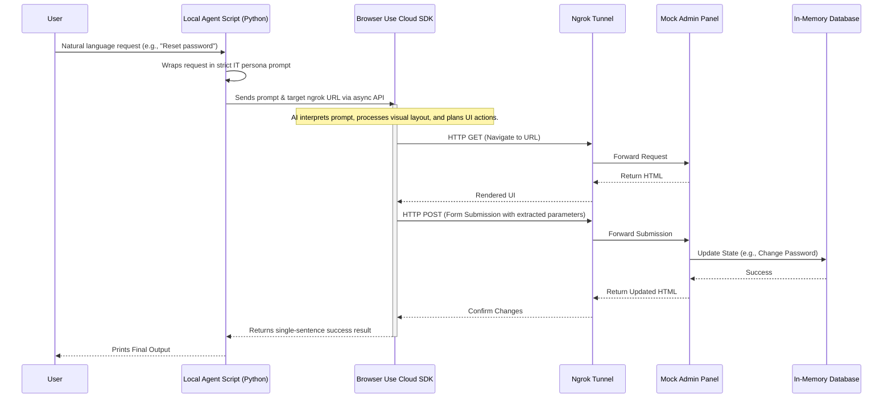

# System Architecture

## Flow Diagram

The following diagram illustrates how a natural language request is processed, handed off to the cloud AI, and executed against the local mock IT environment.

## How It Handles Requests

The system is designed with Object-Oriented Programming (OOP) principles to ensure scalability, reliability, and ease of use.

### 1. Dynamic Prompt Construction

The `ITSupportAgent` class encapsulates the AI instructions. Instead of rewriting the prompt for every task, the script dynamically injects the user's natural language request into a strict structural template. This template enforces:

- **The Starting URL:** Ensuring the agent always begins at the dashboard.
- **Human-like Navigation:** Explicit instructions to use UI navigation links rather than guessing hidden URL paths.
- **Output Constraints:** Forcing the LLM to reply with a concise, single-sentence confirmation rather than verbose reasoning.

### 2. Execution & Edge Case Handling

Requests are executed via an asynchronous method (`execute_task`).

- **UI Resilience:** The Browser Use Cloud SDK natively handles common web automation pitfalls, such as dynamic element loading, layout shifts, or minor UI adjustments.
- **System Failures:** The execution is wrapped in a `try/except` block. If the ngrok tunnel drops, or the external API times out, the script catches the exception gracefully, logs the specific error, and prevents a total application crash.

### 3. Log Filtering

To maintain a professional console output (especially useful for demonstrations), the script uses substring filtering during the live streaming phase. It actively silences repetitive background tool executions (like hidden JavaScript or Python visual evaluations) while allowing the core reasoning and action steps to be visible to the user.
